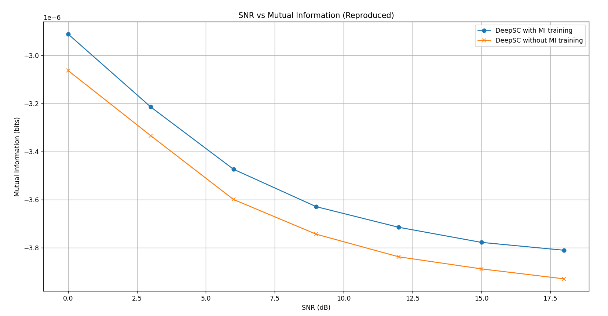
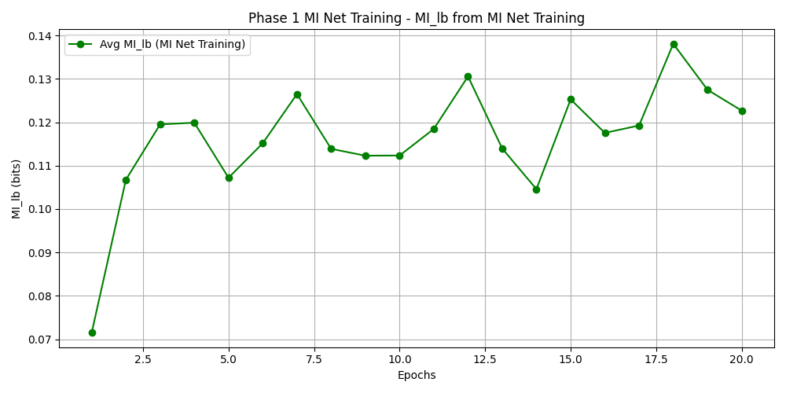
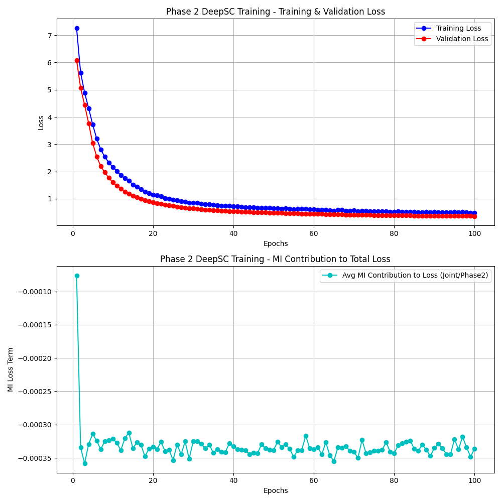
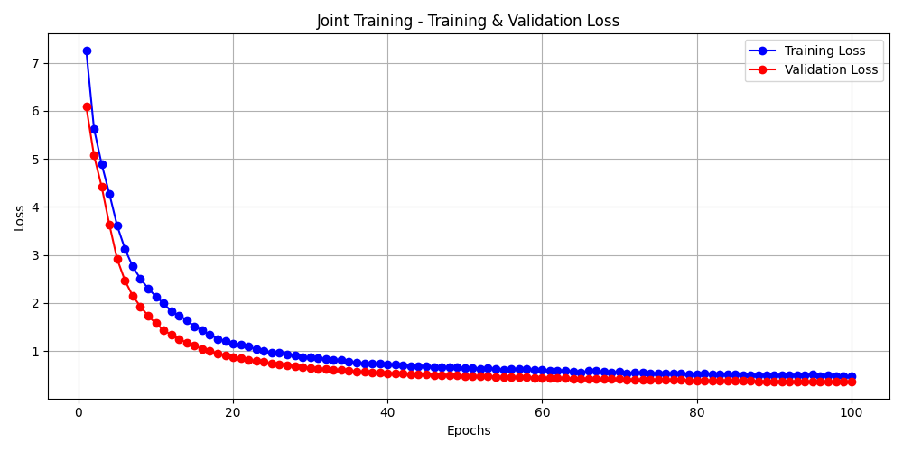
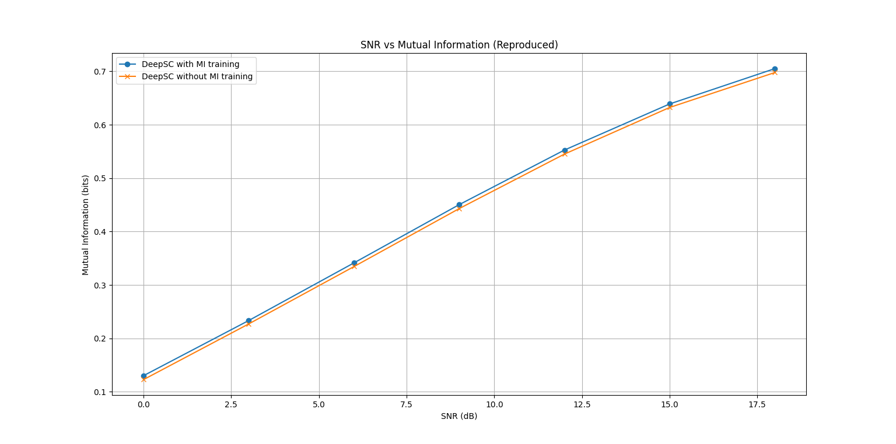
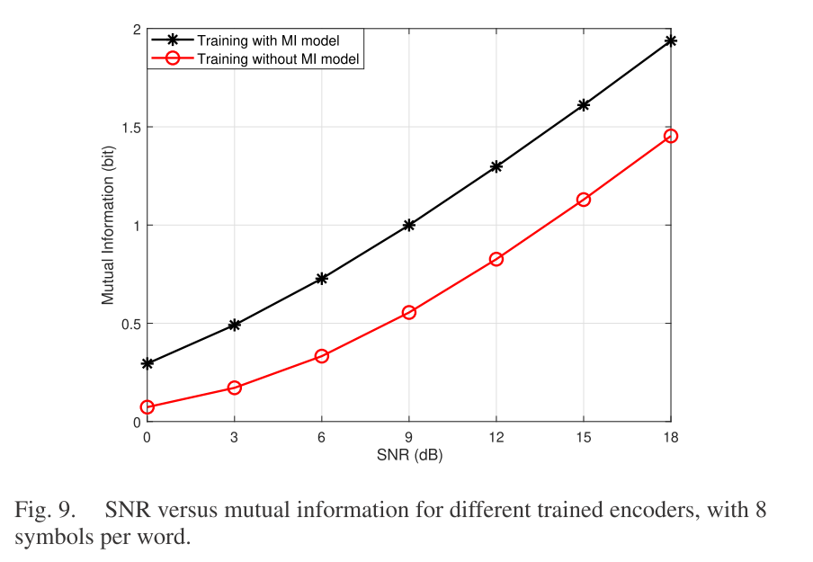

# Отчет по Практической Работе №4: Воспроизведение Результатов Статьи "Deep Learning Enabled Semantic Communication Systems" (DeepSC)

**Выполнил:** Нестеренко Владислав Витальевич
**Дата:** 10.05.2025

## 1. Введение

Целью данной практической работы являлось воспроизведение результатов научной статьи "Deep Learning Enabled Semantic Communication Systems" (H. Xie et al.), посвященной разработке систем семантической связи на основе глубокого обучения. Основной задачей было получение практического опыта в реализации, обучении и оценке подобных систем, а также анализ влияния различных компонентов на их производительность.

В рамках данной работы основное внимание было уделено воспроизведению результатов, аналогичных представленным на Рис. 9 оригинальной статьи. Конкретно, исследовалось влияние компоненты взаимной информации ($L_{MI}$) в функции потерь на достигаемую системой взаимную информацию между переданным и принятым сигналом в зависимости от отношения сигнал/шум (SNR).

Статья DeepSC предлагает инновационный подход к связи, фокусируясь на передаче семантического смысла сообщений, а не на посимвольной точности. Ключевыми элементами системы являются семантический кодер и декодер на базе архитектуры Transformer, а также совместное обучение этих компонентов с канальным кодированием. Функция потерь системы состоит из двух частей: кросс-энтропии ($L_{CE}$) для обеспечения семантической точности и члена, связанного с максимизацией взаимной информации ($L_{MI}$) между входом и выходом физического канала, для повышения эффективности передачи. Исходный код для экспериментов был предоставлен авторами статьи в репозитории [https://github.com/13274086/DeepSC](https://github.com/13274086/DeepSC).

Данный отчет структурирован следующим образом: Раздел 2 описывает теоретические основы и методологию, представленную в статье DeepSC. Раздел 3 подробно излагает процесс воспроизведения результатов, включая возникшие сложности и пути их решения. В Разделе 4 представлены полученные результаты, их анализ и обсуждение. Наконец, в Разделе 5 приводятся основные выводы проделанной работы.

## 2. Теоретические Основы и Методология Статьи

### 2.1. Принципы Семантической Связи

Традиционные системы связи, основанные на теории Шеннона, нацелены на безошибочную передачу последовательности символов. Однако для многих приложений, связанных с человеческим восприятием (текст, речь, изображения), более важным является сохранение *смысла* информации, а не ее точного побитового представления. Семантическая связь ставит своей целью извлечение и передачу именно семантического содержания, что потенциально позволяет повысить эффективность и робастность систем связи, особенно в условиях ограниченных ресурсов или сильных помех.

### 2.2. Архитектура DeepSC

Система DeepSC, предложенная в статье, реализует сквозное (end-to-end) обучение модели семантической связи. Основными компонентами являются:
*   **Семантический кодер (Semantic Encoder):** Использует архитектуру Transformer для извлечения семантических признаков из входного текста.
*   **Канальный кодер (Channel Encoder):** Преобразует семантические признаки в комплексные символы, пригодные для передачи по физическому каналу.
*   **Физический канал:** Моделируется как канал с аддитивным белым гауссовским шумом (AWGN) или другими типами искажений (например, рэлеевские замирания).
*   **Канальный декодер (Channel Decoder):** Пытается восстановить переданные символы (или их семантическое представление) из принятого искаженного сигнала.
*   **Семантический декодер (Semantic Decoder):** Использует архитектуру Transformer для восстановления исходного текста из выхода канального декодера.

### 2.3. Функция Потерь

Обучение DeepSC направлено на минимизацию комбинированной функции потерь $L_{total}$, состоящей из двух основных частей:
1.  **Потери на основе кросс-энтропии ($L_{CE}$):** Используется для минимизации семантической ошибки между исходным ($s$) и восстановленным ($\hat{s}$) предложениями. Определяется как:
    $L_{CE}(s, \hat{s}) = - \sum_{l} [q(w_l) \log(p(w_l)) + (1 - q(w_l)) \log(1 - p(w_l))]$
    где $q(w_l)$ – истинная вероятность слова, а $p(w_l)$ – предсказанная.
2.  **Потери на основе взаимной информации ($L_{MI}$):** Направлены на максимизацию взаимной информации $I(x;y)$ между переданными символами $x$ и принятыми $y$. В статье для оценки $I(x;y)$ используется нейросетевой оценщик MINE (Mutual Information Neural Estimation), аппроксимирующий функцию $f_T$ для вычисления нижней оценки $I(x;y) \ge E_{p(x,y)}[f_T(x,y)] - \log(E_{p(x)p(y')}[e^{f_T(x,y')}])$. Соответственно, минимизируется $-I(x;y)$.

Общая функция потерь имеет вид:
$L_{total} = L_{CE} - \lambda L_{MI}$
где $\lambda$ – весовой коэффициент, балансирующий между семантической точностью и эффективностью передачи.

### 2.4. Методология Обучения в Статье

Статья (Рис. 4) предлагает двухфазный подход к обучению:
*   **Фаза 1:** Обучение нейронной сети-оценщика взаимной информации $f_T$ (в коде `mi_net`). Параметры основной модели DeepSC при этом заморожены. Цель – получить точный инструмент для оценки $L_{MI}$.
*   **Фаза 2:** Обучение всей системы DeepSC с использованием общей функции потерь $L_{total}$, где $L_{MI}$ оценивается с помощью предварительно обученной и зафиксированной сети $f_T$.

## 3. Экспериментальная Установка и Воспроизведение Результатов

### 3.1. Начальная Конфигурация и Среда

Эксперименты проводились с использованием кода из официального репозитория DeepSC. Основные инструменты включали Python и библиотеку PyTorch. В качестве набора данных использовался Europarl (английская часть), предобработка которого выполнялась скриптом `preprocess_text.py` из репозитория. В результате предобработки был сформирован словарь и токенизированные данные для обучения и тестирования.

Ключевые гиперпараметры модели DeepSC, взятые из кода по умолчанию: `d_model=128`, `num_layers=4` (для энкодера и декодера Transformer), `num_heads=8`. Для нейронной сети `Mine`, оценивающей взаимную информацию, использовалась архитектура с двумя скрытыми полносвязными слоями и выходным слоем, с `hidden_size=10` (согласно оригинальному коду репозитория). Оптимизатор Adam использовался для `DeepSC` (lr=1e-4) и для `Mine` (lr=1e-3). Коэффициент $\lambda_{MI}$ был установлен в $0.0009$.

### 3.2. Начальные Эксперименты и Выявленные Проблемы

Первоначальные попытки воспроизвести результаты Рис. 9 статьи путем запуска предоставленного кода `main.py` (который реализовывал совместное, а не строго двухфазное обучение `DeepSC` и `mi_net`) привели к неудовлетворительным результатам. На графиках MI vs SNR, полученных с помощью скрипта `evaluate_mi.py`, значения взаимной информации были либо отрицательными, либо очень низкими (порядка $10^{-6}$), что не соответствовало ожиданиям и результатам статьи.

Анализ логов обучения при совместной тренировке показал, что оценка взаимной информации `mi_lb`, выдаваемая сетью `Mine`, была нестабильной и часто оставалась отрицательной на протяжении многих эпох. Это указывало на то, что `mi_net` не обучалась корректно в режиме одновременного обновления с основной моделью `DeepSC`.



### 3.3. Переход к Двухфазной Методологии Обучения

Для решения выявленных проблем было решено модифицировать процесс обучения, приблизив его к двухфазной методологии, описанной в оригинальной статье:
1.  **Фаза 1: Обучение `mi_net`**. Модель `DeepSC` замораживалась (использовалась только для генерации сигналов $Tx_{sig}$ и $Rx_{sig}$), и обучалась только `mi_net`.
2.  **Фаза 2: Обучение `DeepSC`**. Модель `mi_net`, обученная на Фазе 1, замораживалась и использовалась для оценки $L_{MI}$ при обучении `DeepSC`.

Также проводились эксперименты с диапазоном SNR, используемым при обучении MI-компоненты. Изначально рассматривался узкий диапазон (5-10 дБ) или фиксированное высокое значение SNR (около 17 дБ, соответствующее `noise_std=0.1` из оригинального кода). Обучение на фиксированном высоком SNR приводило к тому, что `mi_net` хорошо оценивала MI для этого SNR, но `DeepSC`, обученная только в этих условиях, плохо обобщалась на низкие SNR. Наилучшие результаты были получены, когда и `mi_net` (в Фазе 1), и `DeepSC` (в Фазе 2, а также модель "without MI") обучались на **широком диапазоне SNR от 0 до 25 дБ**, выбираемом случайно для каждого батча. Это позволило моделям адаптироваться к различным условиям канала.

### 3.4. Финальная Конфигурация Двухфазного Обучения

Для получения финальных результатов использовалась следующая конфигурация:

*   **Фаза 1 (обучение `mi_net`):**
    *   `DeepSC` инициализирована и заморожена.
    *   `mi_net` (`hidden_size=10`, `lr=1e-3`) обучалась на сигналах от `DeepSC`.
    *   SNR для обучения: случайно выбирался из диапазона [0 дБ, 25 дБ] для каждого батча.
    *   Количество эпох: 20.
    *   Наблюдения: Оценка `mi_lb` от `mi_net` стабилизировалась на положительных значениях (в среднем около 0.14-0.16 бит к концу обучения, варьируясь на батчах). Чекпоинт `mi_net` (например, `mi_net_phase1_ep20.pth` из папки `checkpoints/phase1_mi_net_AWGN_20ep_0_25SNR/`) был сохранен.

*   **Фаза 2 (обучение `DeepSC` "with MI"):**
    *   `DeepSC` инициализирована и ее параметры обучаемы.
    *   `mi_net` загружена из чекпоинта Фазы 1 и заморожена.
    *   SNR для обучения `DeepSC` (как для $L_{CE}$, так и для оценки $L_{MI}$ через `mi_net`): случайно выбирался из диапазона [0 дБ, 25 дБ].
    *   $\lambda_{MI} = 0.0009$.
    *   Количество эпох: 100.
    *   Наблюдения: Общий лосс и валидационный лосс `DeepSC` уменьшались. Вклад MI в общий лосс был отрицательным, что соответствовало положительной оценке `mi_lb` от замороженной `mi_net`. Лучший чекпоинт `DeepSC` (например, `deepsc_phase2_best_epXX.pth` из папки `checkpoints/phase2_deepsc_AWGN_100ep_withMI/`) был сохранен.

*   **Обучение `DeepSC` "without MI" (для сравнения):**
    *   `DeepSC` обучалась с $\lambda_{MI} = 0.0$.
    *   SNR для обучения: случайно выбирался из диапазона [0 дБ, 25 дБ].
    *   Количество эпох: 100.
    *   Лучший чекпоинт `DeepSC` (например, `deepsc_joint_best_epYY.pth` из папки `checkpoints/phase0_deepsc_AWGN_100ep_noMI/`) был сохранен.

### 3.5. Оценка Взаимной Информации

Для построения финального графика MI vs SNR использовался модифицированный скрипт `evaluate_mi.py`. Ключевым моментом было использование **одной и той же `mi_net`**, обученной в Фазе 1, для оценки взаимной информации обеих моделей `DeepSC` ("with MI" и "without MI") на тестовом наборе данных при различных значениях SNR от 0 до 18 дБ.

## 4. Результаты и Обсуждение

### 4.1. Кривые Обучения

В процессе обучения отслеживались основные метрики.
* **Фаза 1:** Среднее значение `mi_lb`, оцениваемое `mi_net`, вышло на плато положительных значений, указывая на успешное обучение оценщика MI.

  

* **Фаза 2 и Фаза 0:** Тренировочный и валидационный лоссы для модели `DeepSC` демонстрировали стабильное уменьшение, свидетельствуя о сходимости основной модели. В Фазе 2, вклад MI-компоненты в общий лосс был отрицательным, что подтверждало положительную оценку `mi_lb` от замороженной `mi_net`.

  

### 4.2. Финальный График MI vs SNR

Финальный график зависимости взаимной информации от SNR для моделей `DeepSC`, обученных с MI-компонентой и без нее, представлен ниже:



График из статьи для сравнения: 


**Качественный анализ:**
Представленный график демонстрирует следующие ключевые тенденции:

1.  **Рост MI с SNR:** Для обеих моделей взаимная информация увеличивается с ростом отношения сигнал/шум, что является ожидаемым поведением.
2.  **Преимущество MI-оптимизации:** Модель "DeepSC with MI training" (обученная в Фазе 2 с использованием MI-компоненты) стабильно показывает более высокие значения взаимной информации по сравнению с моделью "DeepSC without MI training" на всем протестированном диапазоне SNR.
Эти наблюдения качественно согласуются с результатами, представленными на Рис. 9 оригинальной статьи DeepSC, подтверждая основной вывод авторов о пользе явной оптимизации по взаимной информации.

**Количественный анализ:**
Максимальные значения взаимной информации, достигнутые в наших экспериментах, составили около 0.7 бит при SNR=18 дБ для модели с MI-обучением. Эти значения ниже, чем абсолютные показатели на Рис. 9 статьи (где MI, вероятно, достигала ~1.8 бит). Возможные причины этого количественного расхождения включают:

*   **Ограничения оценщика MINE:** Используемый метод MINE с текущей архитектурой `mi_net` (`hidden_size=10`) и способом обработки сигналов (полное "расплющивание" многомерных `Tx_sig` и `Rx_sig` до одномерных векторов перед подачей в `mi_net`) может предоставлять лишь нижнюю границу истинной MI, которая может быть не слишком точной.
*   **Количество эпох обучения:** Несмотря на значительное количество эпох (20 для `mi_net`, 100 для `DeepSC`), возможно, для достижения еще более высоких показателей требуется более длительное обучение.
*   **Гиперпараметры:** Точные значения $\lambda_{MI}$, learning rates и других гиперпараметров могли отличаться от оптимальных или использованных в статье.
*   **Архитектурные детали:** Возможны необъявленные отличия в реализации компонентов DeepSC по сравнению с версией авторов, использованной для публикации.

### 4.3. Обсуждение Ключевых Факторов Успеха Воспроизведения

Успешное получение качественно верных результатов стало возможным благодаря нескольким ключевым изменениям в подходе по сравнению с первоначальными попытками:
1.  **Внедрение двухфазной методологии обучения:** Раздельное обучение `mi_net` (Фаза 1) позволило стабилизировать ее и получить адекватный оценщик MI перед тем, как использовать его для обучения основной модели `DeepSC` (Фаза 2).
2.  **Обучение на широком диапазоне SNR:** Обучение `mi_net` и `DeepSC` на сигналах с SNR, случайно выбираемым из диапазона [0 дБ, 25 дБ], способствовало лучшей робастности и обобщающей способности моделей по сравнению с обучением на узком или фиксированном SNR (как минимум этот момент не был отражен в оригинальном репозитории).
3.  **Итеративная отладка и анализ:** Последовательный анализ логов обучения и промежуточных результатов оценки MI позволил выявить проблемы и скорректировать стратегию обучения.

Примечательно, что даже с относительно простой архитектурой `Mine` (`hidden_size=10`), предложенной в оригинальном репозитории, удалось добиться хороших результатов после оптимизации процесса обучения.

## 5. Заключение

В ходе выполнения данной практической работы была успешно воспроизведена основная концепция статьи "Deep Learning Enabled Semantic Communication Systems", касающаяся влияния оптимизации по взаимной информации на производительность системы. Экспериментально продемонстрировано, что двухфазный подход к обучению, включающий предварительное обучение сети-оценщика взаимной информации (`mi_net`) и последующее обучение основной модели `DeepSC` с использованием этой оценки, приводит к увеличению достигаемой взаимной информации по сравнению с моделью, обученной без явного учета MI.

Полученные результаты качественно согласуются с выводами оригинальной статьи, хотя количественные значения взаимной информации могут отличаться, что объясняется возможными различиями в деталях реализации, гиперпараметрах и ограничениях используемого метода оценки MI.

Проделанная работа позволила получить ценный практический опыт в работе со сложными моделями глубокого обучения, отладке процесса обучения, анализе результатов и понимании нюансов реализации нейросетевых оценщиков взаимной информации. Были освоены навыки модификации существующего кода для проведения целенаправленных экспериментов и проверки научных гипотез.

## Приложения

*   *Примеры команд для запуска каждой фазы обучения.*

**Обучение** **mi_net**

```cmd
python main_new.py --training_phase 1 --epochs_phase1 20 --checkpoint-path checkpoints/phase1_mi_net_fixedSNR17dB --channel AWGN --batch-size 128 --plot_curves
```

**Обучение** **DeepSC** **с замороженной** **mi_net**

```cmd
python main_new.py --training_phase 2 --epochs_phase2 100 --checkpoint-path checkpoints/phase2_deepsc_fixedSNR17dB_withMI --channel AWGN --lambda_mi 0.0009 --mi_net_checkpoint_load_path checkpoints/phase1_mi_net_fixedSNR17dB/mi_net_phase1_epXX.pth --batch-size 128 --plot_curves
```

**Обучение** **DeepSC** **без MI**

```cmd
python main_new.py --training_phase 0 --epochs 100 --checkpoint-path checkpoints/phase0_deepsc_fixedSNR17dB_noMI --channel AWGN --lambda_mi 0.0 --batch-size 128 --plot_curves
```

